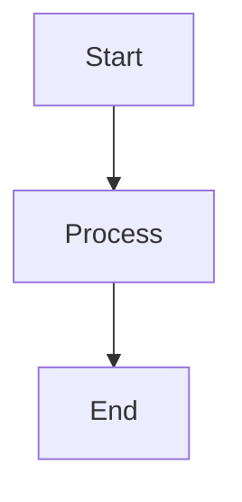

# Installing BasicTeX via MacPorts and Converting Markdown with Mermaid Diagrams to PDF on Mac

This guide provides step-by-step instructions for installing BasicTeX using MacPorts on a Mac, setting up the environment to process LaTeX documents, and converting a Markdown file containing Mermaid diagrams into a PDF with diagrams rendered as images. The process uses MacPorts to install BasicTeX, `mmdc` (Mermaid CLI) to preprocess Mermaid diagrams into images, and Pandoc with `xelatex` to generate the PDF. It includes setup, execution, and troubleshooting steps to ensure a smooth workflow.

## Prerequisites

Before proceeding, ensure you have the following tools and configurations:

1. **MacPorts**: A package manager for installing open-source software on macOS.
   - If not installed, download and install from [MacPorts.org](https://www.macports.org/install.php).
   - Verify installation:
     ```bash
     port version
     ```
     Expected output: Version number (e.g., 2.10.1).
   - Update MacPorts:
     ```bash
     sudo port selfupdate
     sudo port upgrade outdated
     ```

2. **Node.js and npm**: Required for Mermaid CLI.
   - Install via MacPorts:
     ```bash
     sudo port install nodejs20
     ```
     - Note: `nodejs20` is a recent version at the time of writing (July 2025). Check for newer versions with `port search nodejs`.
   - Verify:
     ```bash
     node --version
     npm --version
     ```
     Expected: Node.js v16 or higher (e.g., v20.x.x), npm v8 or higher (e.g., v10.x.x).

3. **Mermaid CLI**: Renders Mermaid diagrams to images.
   - Install globally via npm:
     ```bash
     sudo npm install -g @mermaid-js/mermaid-cli
     ```
   - Verify:
     ```bash
     mmdc --version
     ```
     Expected: Version 11.6.0 or similar.

4. **Pandoc**: Converts Markdown to PDF.
   - Install via MacPorts:
     ```bash
     sudo port install pandoc
     ```
   - Verify:
     ```bash
     pandoc --version
     ```
     Expected: Version 3.7.0.2 or higher.

## Installing BasicTeX via MacPorts

BasicTeX is a compact TeX distribution, ideal for users who need LaTeX (including `xelatex` for PDF generation) without the larger MacTeX package. MacPorts provides a `texlive-basic` port that serves as an equivalent to BasicTeX.

### Steps

1. **Install `texlive-basic`**:
   ```bash
   sudo port install texlive-basic
   ```
   - This installs a minimal TeX distribution, including `xelatex`, to `/opt/local/bin`.
   - Installation size is approximately 100–200 MB, much smaller than MacTeX (~8 GB).[](https://tex.stackexchange.com/questions/97183/what-are-the-practical-differences-between-installing-latex-from-mactex-or-macpo)

2. **Install Additional Fonts**:
   For Chinese text support (e.g., `PingFang SC` or `Songti SC`), install recommended fonts:
   ```bash
   sudo port install texlive-fonts-recommended
   ```
   - This ensures fonts for multilingual documents are available.

3. **Verify Installation**:
   Check that `xelatex` is installed:
   ```bash
   xelatex --version
   ```
   Expected: Output like `XeTeX 3.141592653-2.6-0.999997 (TeX Live 2025)`.

4. **Update PATH**:
   MacPorts installs binaries to `/opt/local/bin`. Ensure this is in your PATH:
   ```bash
   echo $PATH
   ```
   If `/opt/local/bin` is missing, add it to `~/.zshrc`:
   ```bash
   echo 'export PATH=/opt/local/bin:$PATH' >> ~/.zshrc
   source ~/.zshrc
   ```
   Verify:
   ```bash
   which xelatex
   ```
   Expected: `/opt/local/bin/xelatex`.

## Converting Markdown with Mermaid Diagrams to PDF

To convert a Markdown file with Mermaid diagrams (e.g., `input.md`) to a PDF with diagrams rendered as images, use `mmdc` to preprocess the diagrams into images and Pandoc with `xelatex` to generate the PDF.

### Step-by-Step Process

### 1. Prepare the Markdown File
Create or verify your Markdown file (e.g., `input.md`) with a Mermaid diagram. Ensure proper Mermaid syntax with node labels and line breaks.

Example `input.md`:
```markdown
---
mainfont: "PingFang SC"
---
# Test Document


```
- Use triple backticks with `mermaid` (`` ```mermaid ``).
- Define nodes with labels (e.g., `A[Start]`) and separate statements with line breaks to avoid parse errors.
- For Chinese text, specify a font like `PingFang SC` or `Songti SC` in the YAML header.
- Save in your working directory (e.g., `~/workspace`):
  ```bash
  cd ~/workspace
  cat input.md
  ```

### 2. Preprocess Mermaid Diagrams
Use `mmdc` to convert Mermaid code blocks into image references (PNG or SVG) in a new Markdown file:
```bash
mmdc -i input.md -o output-with-images.md -e png --theme neutral
```
- `-e png`: Outputs PNG images (use `-e svg` for vector images if preferred).
- `--theme neutral`: Ensures consistent diagram styling.
- Images (e.g., `mermaid-image-0.png`) are saved in `~/workspace`.

Verify the output:
```bash
cat output-with-images.md
ls *.png
open mermaid-image-0.png
```
Expected `output-with-images.md`:
```markdown
---
mainfont: "PingFang SC"
---
# Test Document


```

### 3. Convert to PDF
Convert the processed Markdown to PDF using Pandoc and `xelatex`:
```bash
pandoc output-with-images.md -o output.pdf --pdf-engine=xelatex
```
- Ensure `mermaid-image-0.png` is in `~/workspace`.
- The `--pdf-engine=xelatex` flag supports Chinese fonts via the `mainfont` setting.

Verify the PDF:
```bash
open output.pdf
```
The Mermaid diagram should appear as an image, not text.

### 4. Verify Chinese Font Support
If Chinese text is garbled, confirm the font is available:
```bash
fc-list :lang=zh | grep PingFang
```
If `PingFang SC` is missing, use `Songti SC` or another font:
```markdown
---
mainfont: "Songti SC"
---
```
Update `input.md` and repeat steps 2–3. Alternatively, install additional fonts:
```bash
sudo port install texlive-fonts-extra
```

## Troubleshooting

### Mermaid Diagram Not Rendering
If `output-with-images.md` contains raw Mermaid code:
- **Check Syntax**: Ensure nodes are defined (e.g., `A[Start] --> B[Process]`) with line breaks. Test in the [Mermaid Live Editor](https://mermaid.live).
- **Verbose Mode**:
  ```bash
  mmdc -i input.md -o output-with-images.md -e png --theme neutral --verbose
  ```
  Look for parse errors (e.g., `Expecting 'NEWLINE', got 'NODE_STRING'`).
- **Puppeteer Config**: If rendering fails, create `puppeteer.json` in `~/workspace`:
  ```json
  {
    "headless": true,
    "timeout": 60000
  }
  ```
  Run:
  ```bash
  mmdc -i input.md -o output-with-images.md -e png --puppeteerConfigFile puppeteer.json
  ```
- **Downgrade `mmdc`**: If version 11.6.0 fails, try an older version:
  ```bash
  sudo npm uninstall -g @mermaid-js/mermaid-cli
  sudo npm install -g @mermaid-js/mermaid-cli@10.9.1
  ```

### PDF Issues
If the PDF is blank or missing the diagram:
- Verify `mermaid-image-0.png` exists:
  ```bash
  ls ~/workspace/*.png
  ```
- Run Pandoc with verbose output:
  ```bash
  pandoc output-with-images.md -o output.pdf --pdf-engine=xelatex --verbose
  ```
- Ensure `xelatex` is accessible:
  ```bash
  which xelatex
  ```
  If missing, reinstall:
  ```bash
  sudo port install texlive-basic
  ```

### Permissions or PATH Issues
If `mmdc`, `pandoc`, or `xelatex` are not found:
- Verify `/opt/local/bin` is in PATH:
  ```bash
  echo $PATH
  echo 'export PATH=/opt/local/bin:$PATH' >> ~/.zshrc
  source ~/.zshrc
  ```
- Check permissions:
  ```bash
  ls -l /opt/local/bin/mmdc /opt/local/bin/xelatex /opt/local/bin/pandoc
  chmod u+x /opt/local/bin/mmdc /opt/local/bin/xelatex /opt/local/bin/pandoc
  ```

### Missing LaTeX Packages
If Pandoc reports missing packages (e.g., `fontspec.sty`):
- Install via `tlmgr`:
  ```bash
  sudo tlmgr install fontspec
  ```
- Update `tlmgr`:
  ```bash
  sudo tlmgr update --self --all
  ```
- Set a closer repository for faster downloads:
  ```bash
  sudo tlmgr option repository http://ftp.yzu.edu.tw/CTAN/systems/texlive/tlnet
  ```

## Alternative: Manual Diagram Rendering
If `mmdc` fails to process Markdown:
1. Extract Mermaid code to `diagram.mmd`:
   ```bash
   echo -e 'graph TD\n    A[Start] --> B[Process]\n    B --> C[End]' > diagram.mmd
   ```
2. Render to PNG:
   ```bash
   mmdc -i diagram.mmd -o diagram.png --theme neutral
   open diagram.png
   ```
3. Create `manual.md`:
   ```markdown
   ---
   mainfont: "PingFang SC"
   ---
   # Test Document

   
   ```
4. Convert to PDF:
   ```bash
   pandoc manual.md -o output.pdf --pdf-engine=xelatex
   open output.pdf
   ```

## Notes
- **Why MacPorts?**: MacPorts allows fine-grained control over TeX packages, saving disk space compared to MacTeX (~15 GB vs. ~1–2 GB for `texlive-basic`). It integrates well with other MacPorts packages and is ideal for command-line users.[](https://tex.stackexchange.com/questions/97183/what-are-the-practical-differences-between-installing-latex-from-mactex-or-macpo)
- **Mermaid Syntax**: Always use node labels (e.g., `A[Text]`) and line breaks to avoid parse errors in `mmdc`.
- **Font Support**: Install `texlive-fonts-recommended` or `texlive-fonts-extra` for robust multilingual support.
- **Updates**: Keep tools updated:
  ```bash
  sudo port selfupdate
  sudo port upgrade outdated
  sudo npm install -g @mermaid-js/mermaid-cli
  sudo tlmgr update --all
  ```
- **Resources**: Use the [Mermaid Live Editor](https://mermaid.live) to test diagrams and [TeX Stack Exchange](https://tex.stackexchange.com) for LaTeX issues.

This guide ensures you can install BasicTeX via MacPorts and convert Markdown files with Mermaid diagrams to PDFs with diagrams rendered as images. If issues arise, share error outputs and tool versions (`port version`, `mmdc --version`, `pandoc --version`, `xelatex --version`) for further assistance.